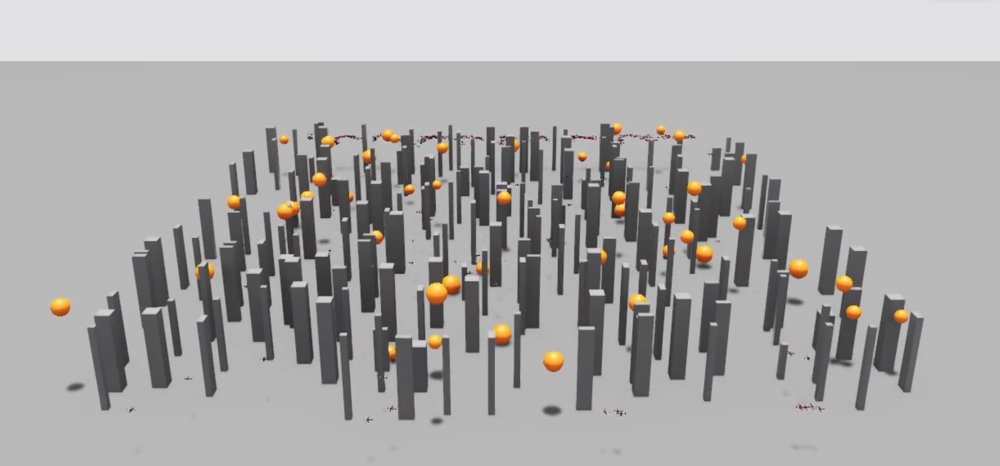

# FLA_RL: 基于强化学习的飞行器路径规划项目

## 🌟 项目简介
本项目旨在利用强化学习（Reinforcement Learning）算法在复杂的三维空间中实现飞行器的自主避障与路径规划。

---

## 📊 项目展示 (Showcase)

### 1. 训练环境 (Training Environment)
项目构建了一个包含密集柱状障碍物和目标点的 3D 仿真环境。


### 2. 训练演示 (Demo Video)
以下是智能体在环境中进行任务测试的完整视频：
[点击查看训练演示视频](./picture/recording_5333_1069903925c3fbe710b7最优视频.mp4) 

### 3. 性能指标 (Metrics)
通过在 `picture` 文件夹中的实验结果记录，本项目在当前场景下达到了显著的收敛效果：
* **任务成功率 (Success Rate)**: [99%+]
* **碰障率**: [1%]


---

## 🛠 环境配置 (System Requirements)

本项目在高性能计算节点上完成开发与测试，建议配置如下：

### 硬件要求
* **GPU**: NVIDIA GeForce RTX 4090 (24GB 显存)
* **存储**: 系统盘 30GB + 数据盘 50GB

### 软件环境
* **操作系统**: Ubuntu 20.04
* **镜像基础**: Miniconda / Conda3
* **Python 版本**: 3.8
* **CUDA 版本**: 11.8

---

## 🚀 使用指南 (Getting Started)

### 1. 克隆项目
```bash
git clone [https://github.com/drr-afterglow/FLA_RL.git](https://github.com/drr-afterglow/FLA_RL.git)
conda activate NavRL
wandb login
cd FLA_RL/isaac-training/train/scripts
python train.py
